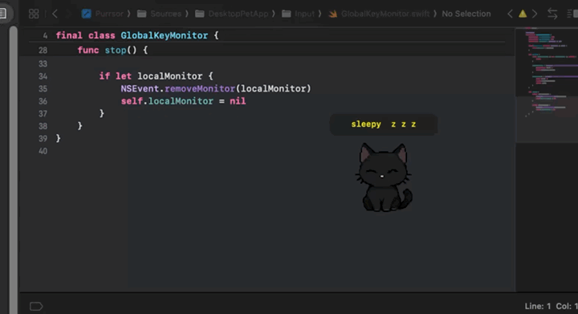

<p align="center">
  
</p>

<h1 align="center">Purrsor</h1>

<p align="center">A tiny macOS desktop cat that reacts to your typing, naps on your screen, and stays out of the way.</p>

<p align="center">
  
  
  
</p>

<p align="center">
  <a href="docs/readme-assets/demo.mp4">
    
  </a>
</p>

Purrsor is a native macOS desktop pet built with AppKit. It stays intentionally small:

- transparent always-on-top overlay
- keyboard-reactive cat moods
- local reminders and customization
- no cloud services, accounts, or telemetry

## Platform

- Supported: macOS 14+
- Stack: native `Swift + AppKit`
- Distribution: local source builds and manual app bundles
- Notarization: not currently notarized

## Features

- always-on-top transparent cat overlay
- global keyboard activity detection
- idle, typing, overheated, petting, stretch, and sleep states
- cursor-tracked idle eyes
- drag-to-reposition desktop pet
- menu bar controls
- launch at login toggle in preferences
- customizable text bubble and typing indicator
- adjustable overlay scale
- stretch reminders

## Project Layout

- `project.yml` defines the XcodeGen project
- `Purrsor.xcodeproj` is the generated Xcode project
- `Config/Info.plist` contains app bundle metadata
- `Sources/DesktopPetApp` contains the application source
- `docs/architecture.md` contains architecture notes
- `scripts/` contains build helpers

## Development

This repo uses an Xcode workflow.

Generate the project and open it in Xcode:

```bash
xcodegen generate
open Purrsor.xcodeproj
```

For a terminal-driven debug app bundle:

```bash
chmod +x scripts/dev-bundle-app.sh
./scripts/dev-bundle-app.sh
open Build/Purrsor.app
```

For a stable DerivedData debug build:

```bash
chmod +x scripts/dev-build-xcode-app.sh
./scripts/dev-build-xcode-app.sh
open /private/tmp/PurrsorDerivedData/Build/Products/Debug/Purrsor.app
```

Use a real `.app` bundle when testing Accessibility-sensitive behavior such as global keyboard monitoring.

## Building a standalone app

To produce a standalone `.app` that you can move into `/Applications`:

```bash
chmod +x scripts/build-app.sh
./scripts/build-app.sh
cp -R Build/Release/Purrsor.app /Applications/
```

## Installation Notes

The generated app bundle is ad hoc signed for local use, but it is not notarized by Apple. Gatekeeper may block it the first time you try to open it.

Recommended flow:

1. Build the app with `./scripts/build-app.sh`.
2. Copy `Build/Release/Purrsor.app` into `/Applications`.
3. Try opening `/Applications/Purrsor.app`.
4. If macOS blocks it, right-click the app in Finder, choose `Open`, then confirm `Open`.
5. If that option does not appear, go to `System Settings > Privacy & Security`.
6. Find the security message for `Purrsor.app` and click `Open Anyway`.
7. Launch the app again and confirm the dialog.

If you prefer a terminal command for this app only, remove gatekeeper check:

```bash
xattr -dr com.apple.quarantine /Applications/Purrsor.app
```

After first launch, grant Accessibility permission:

1. Open `System Settings > Privacy & Security > Accessibility`
2. Enable access for `/Applications/Purrsor.app`

Notes:

- If you keep multiple copies of `Purrsor.app` around, macOS privacy controls can become confusing. For normal use, keep only one installed copy in `/Applications` and avoid launching a second copy from `Build` or `DerivedData`.
- If you rebuild and replace the app bundle, you may need to remove the old Accessibility entry and add the new one again.
- This repo does not currently ship a notarized release flow.

## Accessibility permission stability

macOS tracks privacy permissions like Accessibility using the app's code identity. Apple notes that unsigned code has no stable designated requirement, and ad hoc signing is tied to one specific build, so permissions can reset when the app changes.

- Xcode builds in this repo now use ad hoc signing by default instead of being fully unsigned.
- For the most stable local install, sign every rebuild with the same real signing identity.
- If you switch identities later, for example from ad hoc to Apple Development or from Apple Development to Developer ID, macOS may ask for Accessibility permission again.

To inspect available signing identities:

```bash
security find-identity -v -p codesigning
```

To build a locally signed app with a specific identity:

```bash
SIGNING_IDENTITY="Apple Development: Your Name (TEAMID)" ./scripts/build-app.sh
```

If Accessibility keeps flipping off, clean up duplicate installs and reset the permission entry:

```bash
tccutil reset Accessibility com.anuraagkhare.purrsor
tccutil reset Accessibility com.anuraagkhare.purrsor.dev
```


## Next milestones

- Add broader set of poses and improved animations.
- Expand reminder UI and scheduling options.
- Improve signing and packaging for smoother local installs.
- Add a focused reminder mode such as pomodoro-style prompts.
